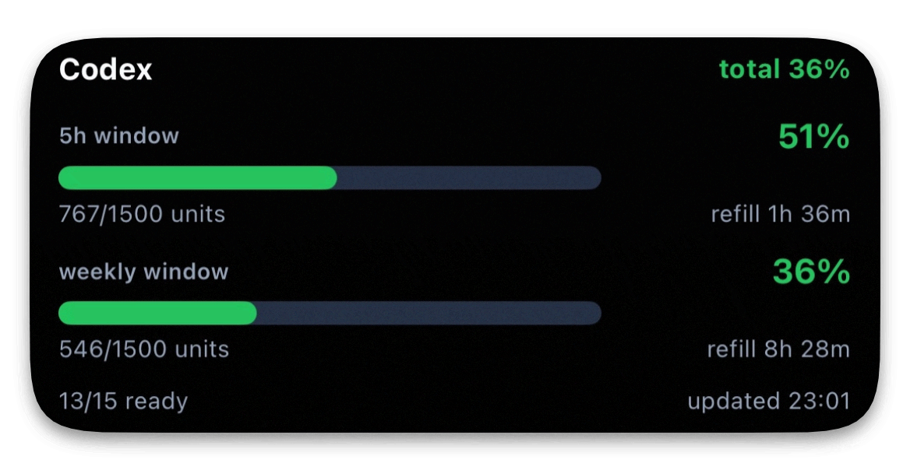
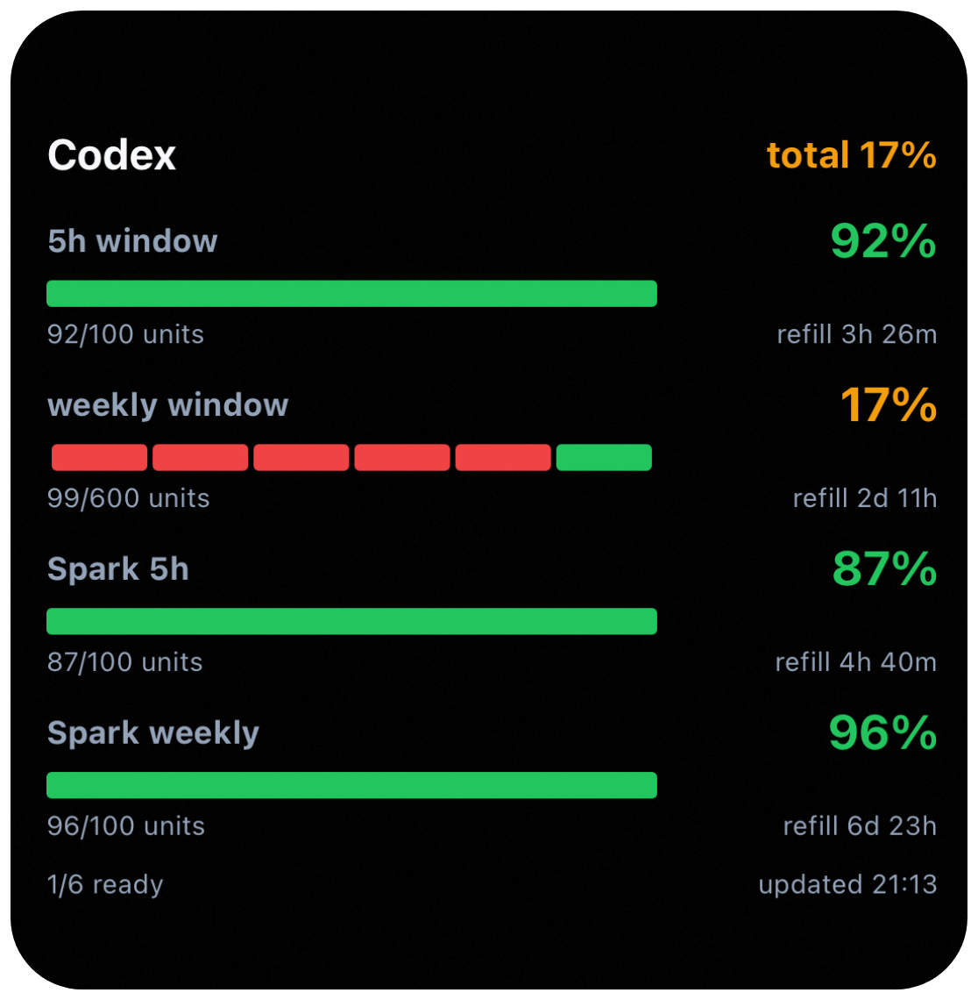

<h1 align="">codex-quota-widget</h1>

<p align="">
  tiny bridge + scriptable widget for codex quota on your home screen.
</p>

show one regular codex account directly, or merge multiple codex accounts through cliproxyapi, in one home-screen view with unified 5-hour and weekly quota windows.

<p align="center">
  
</p>

---

## quick start

run the bridge on the machine that has your regular codex login:

```bash
git clone https://github.com/Microck/codex-quota-widget.git
cd codex-quota-widget

CODEX_QUOTA_WIDGET_TOKEN="$(openssl rand -hex 18)" \
CODEX_QUOTA_WIDGET_HOST="127.0.0.1" \
node server.mjs
```

single-account mode expects `codex login` with **Sign in with ChatGPT**. API-key-only login does not expose the ChatGPT quota endpoint that this widget reads.

or create a local env file:

```bash
cp .env.example .env
$EDITOR .env
```

if your phone reaches the machine over tailscale, bind the bridge to that tailscale address:

```bash
CODEX_QUOTA_WIDGET_TOKEN="<your-widget-token>" \
CODEX_QUOTA_WIDGET_HOST="100.x.y.z" \
node server.mjs
```

open:

```text
http://100.x.y.z:8765/quota?token=<your-widget-token>
```

by default, the bridge reads `~/.codex/auth.json`. set `CODEX_AUTH_FILE=/path/to/auth.json` if your codex auth lives somewhere else.

for multiple codex accounts, run the bridge on the machine that runs cliproxyapi and set `CLIPROXY_MANAGEMENT_KEY`. when that variable is present, the bridge uses cliproxyapi's enabled codex auths instead of the single local auth file.

---

## start at boot

install the systemd service on the machine that has your codex login:

```bash
cp .env.example .env
perl -0pi -e "s/replace-with-output-of-openssl-rand-hex-18/$(openssl rand -hex 18)/" .env
$EDITOR .env
./install-startup-service.sh
```

the installer writes `codex-quota-widget.service` to `/etc/systemd/system`, starts it immediately, and enables it for `multi-user.target`.

the generated service:

- reads bridge configuration from the ignored local `.env`
- starts after network ordering
- also waits for `cliproxyapi.service` when `CLIPROXY_MANAGEMENT_KEY` is set
- includes Tailscale ordering for hosts that bind to a Tailscale address
- restarts every 10 seconds if the bridge exits while dependencies finish starting

check it later with:

```bash
systemctl status codex-quota-widget.service --no-pager
```

---

## ios widget

install Scriptable, paste `scriptable-widget.js`, and set:

```js
const QUOTA_URL = "http://100.x.y.z:8765/quota?token=<your-widget-token>";
```

then add a Scriptable widget to the home screen and select the script.

the script asks ios to refresh the widget every 5 minutes. ios may still delay home-screen widget refreshes.

---

## what it reads

in single-account mode, the bridge reads regular codex auth from:

- `~/.codex/auth.json`, or `CODEX_AUTH_FILE` when set

for multi-account mode, set `CLIPROXY_MANAGEMENT_KEY`. the bridge then uses cliproxyapi management endpoints:

- `GET /v0/management/auth-files`
- `POST /v0/management/api-call`

for each codex auth, it calls:

```text
https://chatgpt.com/backend-api/wham/usage
```

the widget shows merged 5-hour and weekly windows, ready/blocked account counts, and refill times.
if the usage response includes a separate `GPT-5.3-Codex-Spark` quota under
`additional_rate_limits`, the bridge returns it as a separate optional `spark`
summary and the widget shows it only for accounts that actually report that quota.

<p align="center">
  
</p>

tokens, auth file paths, and the management password are not returned by the bridge.
